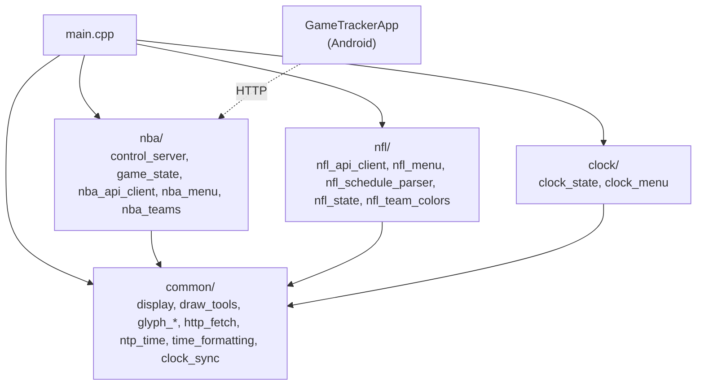
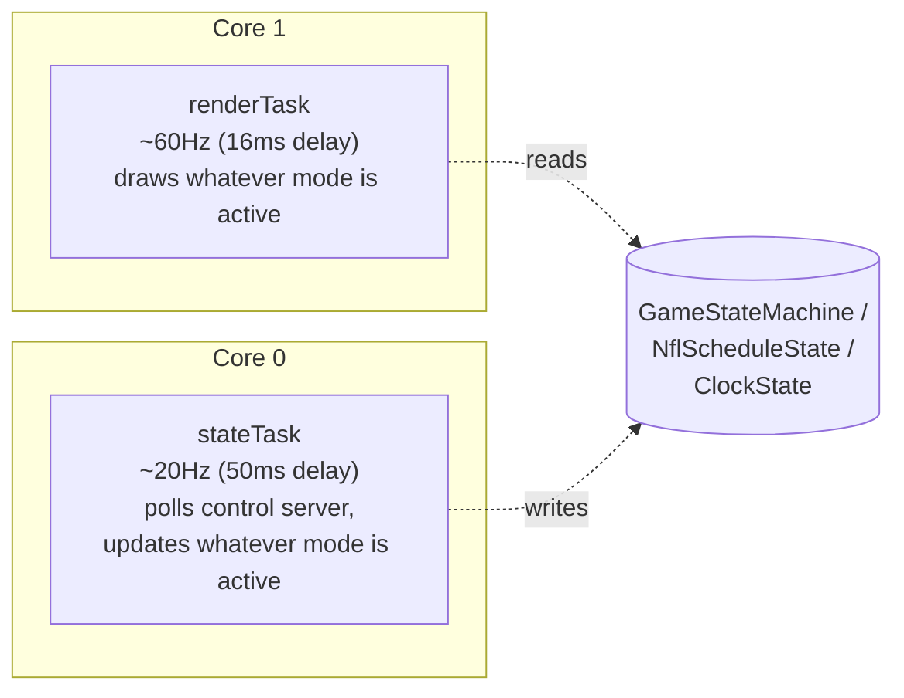
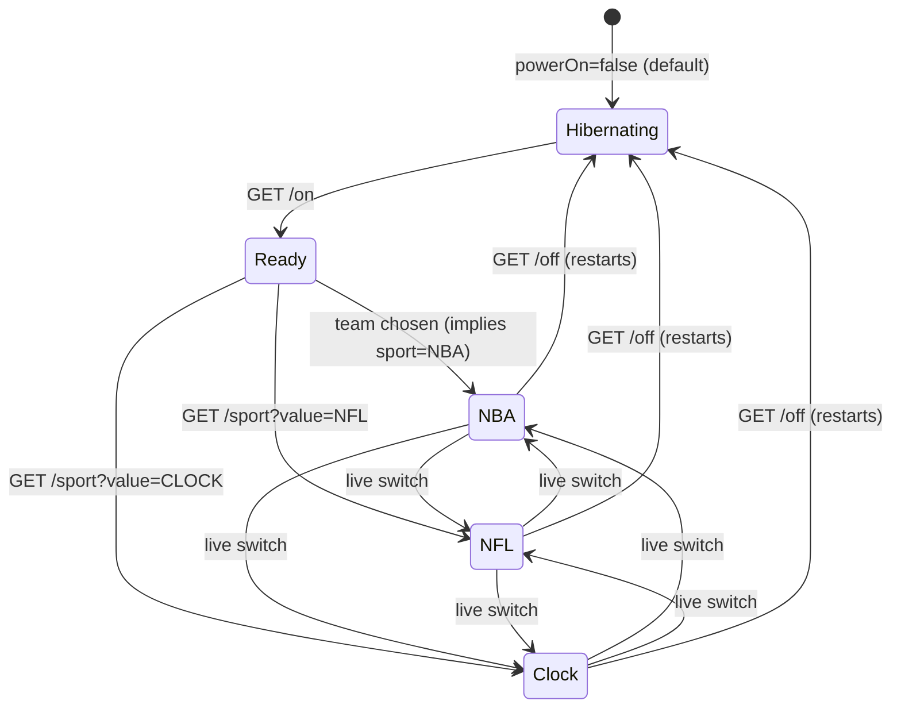
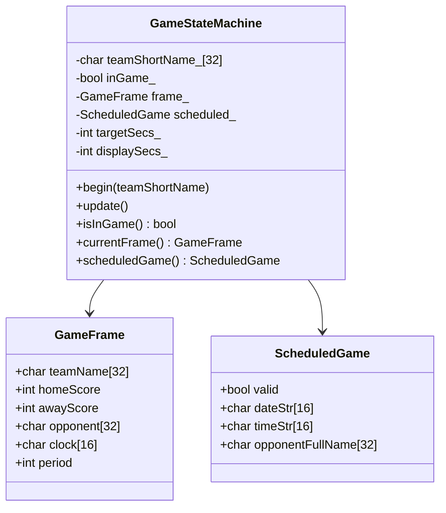
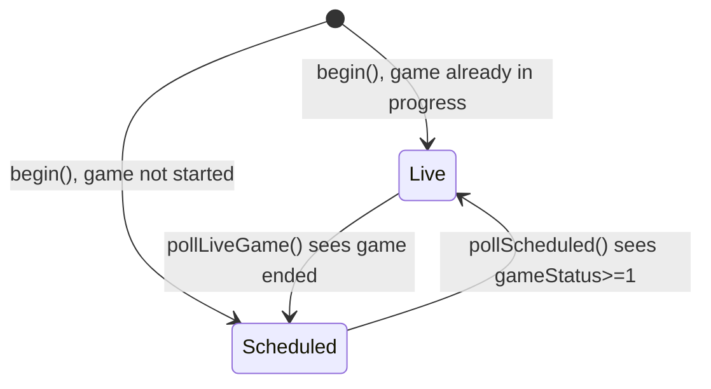
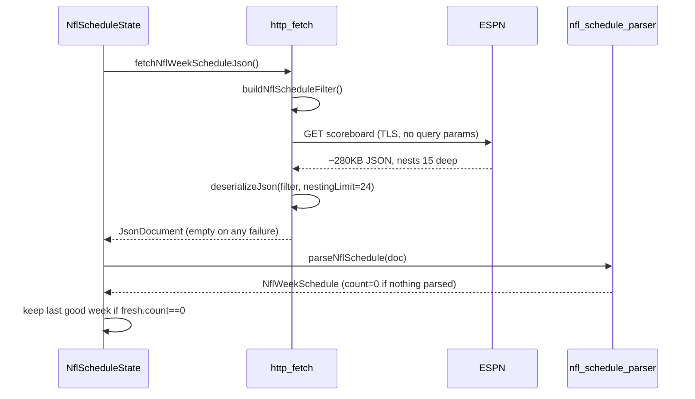
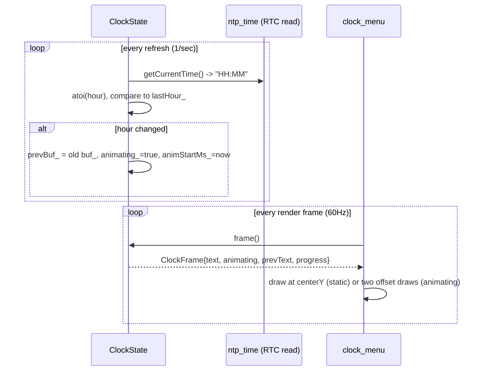
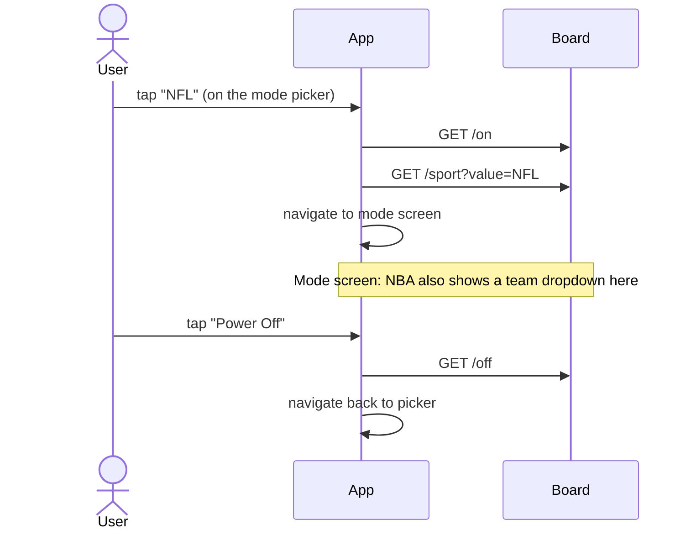

# Game Tracker 2.0 — Project Rundown

Written for one reader: you, later, needing to explain why this is built the way it is. HOW is in the code and comments. This is WHY. Diagrams are Mermaid — GitHub and VS Code render them directly in the `.md` preview.

## Contents

1. [What this is](#1-what-this-is)
2. [Timeline](#2-timeline)
3. [Hardware](#3-hardware)
4. [Architecture: the common/nba/nfl/clock split](#4-architecture-the-commonnbanflclock-split)
5. [Runtime model: two FreeRTOS tasks](#5-runtime-model-two-freertos-tasks)
6. [The mode system](#6-the-mode-system)
7. [NBA mode](#7-nba-mode)
8. [NFL mode](#8-nfl-mode)
9. [Clock mode](#9-clock-mode)
10. [The font system](#10-the-font-system)
11. [Networking layer](#11-networking-layer)
12. [Control server + companion app](#12-control-server--companion-app)
13. [Testing philosophy](#13-testing-philosophy)
14. [Bug log: root cause and why the fix is correct](#14-bug-log-root-cause-and-why-the-fix-is-correct)
15. [Known debt](#15-known-debt)
16. [Cheat sheet: "why did you..."](#16-cheat-sheet-why-did-you)

---

## 1. What this is

A 64×64 LED matrix scoreboard on an ESP32-S3. Three modes: NBA (live score/clock for one team), NFL (the week's schedule + odds), Clock. Controlled over the LAN by a web page or an Android app. No buttons on the board — all input is HTTP.

## 2. Timeline

Rough order, not exact dates:

1. CircuitPython prototype on the same hardware, ported to C++/Arduino/PlatformIO for real FreeRTOS control.
2. NBA-only. Live score from `cdn.nba.com`, next-game lookup from balldontlie.io.
3. `TEST_SERVER` flag added so development didn't depend on a live NBA game existing — `test/TestServer.py` mocks the feed.
4. Hardware bugs found and fixed as the board came up: TLS vs plain-HTTP client mismatch, wrong IP typed into a config, `bitDepth=1` washing out colors, R/B channel swap (see §14).
5. Android app built — deliberately `HttpURLConnection` only, no Retrofit/OkHttp, no navigation library. Power, team select, mDNS auto-discovery.
6. Control architecture evaluated (HTTP vs MQTT vs BLE) — HTTP kept, see §16.
7. NFL added. Spec was narrow on purpose: schedule + odds, no live tracking. ESPN's unofficial endpoint chosen over balldontlie (see §16).
8. **Sport split**: codebase reorganized into `common/` / `nba/` / `nfl/` so a second league didn't mean touching NBA code. See §4.
9. Live NBA↔NFL switching wired into firmware and app — `AppInput.sport`, checked every loop iteration, not just at boot.
10. NFL visual design iterated hard over many rounds (sizing, color, spacing) ending in the ink-bounds font rewrite — see §10. This is the one piece of this project that got the most design attention.
11. NFL flipped from mock to live ESPN data for the season; promptly broke on real hardware (deep JSON, not what was first guessed — see §14); fixed.
12. Clock mode added: a first draft with real bugs (buffer overflow, dangling pointer, dead code, bad linkage — see §14), fixed, then given an hour-change scroll animation.
13. Comment pass: banner-style section headers copied from a separate bare-metal project's style, cleaned up to stay terse.
14. Android app reworked from one crowded screen into two: mode picker, then mode-specific controls. Firmware got a "READY" standby screen to match.

## 3. Hardware

Adafruit MatrixPortal ESP32-S3, 64×64 HUB75 panel. 5 address lines, not the more common 4 — per Adafruit_Protomatter's own sizing rule (`height = 2^addrCount * 2`), that's what makes it 64 rows instead of 32. Bit depth 4.

```
RGB   [R1,G1,B1,R2,G2,B2] = 40, 41, 42, 37, 39, 38
ADDR  [A,B,C,D,E]         = 45, 36, 48, 35, 21
CLOCK = 2   LATCH = 47   OE = 14
```

RGB order above already has R and B swapped from a literal silkscreen reading — see §14.

## 4. Architecture: the common/nba/nfl/clock split



**Why this split, not one flat `src/`:** every league needs its own data shape (NBA team IDs vs NFL abbreviations, different APIs, different odds fields) but the same drawing/text/networking primitives. Before the split, NBA code and shared code were tangled in the same files; adding NFL would have meant editing NBA's files to make room. After the split, NFL is three new files that import from `common/` and touch nothing in `nba/`. Clock mode proved this works: it's four small files, zero edits to `nba/` or `nfl/`.

**Known wart:** `AppInput` (the mode/power/team state shared by all three modes) lives in `nba/control_server.h`, a holdover from when NBA was the only mode. It should arguably be in `common/`. Left alone because moving it touches every mode's includes for no behavior change — not worth the diff. See §15.

## 5. Runtime model: two FreeRTOS tasks



**Why two tasks, not one loop:** drawing (`matrix.show()`) and fetching (an HTTP GET, a TLS handshake) have completely different, incompatible timing needs. A single loop would either stall the display during every fetch or throttle fetches to the display's frame rate for no reason. Splitting them across both ESP32-S3 cores means a slow NFL fetch never produces a dropped frame.

**Why render only reads, state only writes:** there's no mutex anywhere on `AppInput` or the mode state objects. This works because of a strict convention, not synchronization: `stateTask` is the only writer to mode state, `renderTask` is read-only. It's a real latent risk (flagged in `test/TEST_PLAN.md` from early on) but has never caused a visible glitch, because a torn read of, say, `NflWeekSchedule` mid-write would at worst show one frame with a stale game — not a crash, since nothing is ever freed or resized while rendering reads it.

## 6. The mode system

`AppInput.sport` (a `char[8]`: `"NBA"`, `"NFL"`, or `"CLOCK"`) is the single source of truth for which mode is active. Both tasks check it every iteration — not cached, not set-once-at-boot.



**Why it checks every loop iteration instead of once at boot:** this is what makes mode switching live. Early on, sport was only read at boot — changing it required a reflash or at least a reboot. Moving the check inside the render/state loops cost nothing (it's a 3-byte `strcmp`) and turned "pick a mode" into something the app can do any time, not just once at power-on.

**Why `/off` restarts the board instead of just setting a flag:** simplicity. A restart guarantees every mode's state machine starts clean next time (no stale `GameStateMachine`/`NflScheduleState`/`ClockState` left half-initialized). The cost — losing WiFi/NTP sync and having to redo both — is cheap on this hardware and happens rarely (a human pressing "off").

## 7. NBA mode





Two polling intervals, both deliberate: `LIVE_POLL_MS` (20s) for a live game — frequent enough to feel current, far short of balldontlie's rate limits. `SCHED_POLL_MS` (5 min) for "is it live yet" — a scheduled game's status changes rarely, polling every 20s would be pure waste.

**The clock catch-up problem:** the live API is polled every 20s but the displayed clock ticks down every second locally, so it doesn't visibly freeze between polls. At a period/OT transition, the API's clock jumps UP (new period starts near 12:00), and a naive "count down toward target" would freeze at 0:00 forever waiting for a target it can't reach by counting down. `nextDisplaySeconds()` (its own file, `common/clock_sync.h`, unit tested) is the one-line fix: if the API's value is ever ahead of the display, reseed instead of continuing to count down.

## 8. NFL mode



**Why ESPN over balldontlie** (already used for NBA): balldontlie's NFL odds need its paid GOAT tier. ESPN's scoreboard endpoint is free, no key, and includes odds in the same response — no second call. The tradeoff: it's unofficial and undocumented, so nothing alerts if it changes shape mid-season. Accepted because the alternative was $40/mo for data that was free elsewhere.

**Why a bare request with no `week`/`seasontype` params:** ESPN resolves "current week" server-side correctly across preseason/regular/postseason. A hardcoded date table would need yearly upkeep for boundaries that shift a few days every season; ESPN already solves it.

**Why a filter at all, not just parse the whole response:** the response is ~280KB. `buildNflScheduleFilter()` keeps only the handful of fields `parseNflSchedule()` actually reads. See §14 for why this alone didn't fix the real crash.

**Why team colors are hand-curated, not pulled from ESPN's `team.color` field:** ESPN's own color data doesn't always match how a fan would describe a team's colors — its Patriots "color" is navy, not red. `nfl_team_colors.cpp` encodes the colors people actually expect.

## 9. Clock mode



**Why `frame()` samples `millis()` fresh on every call instead of `update()` precomputing progress:** `update()` runs on `stateTask` at ~20Hz; `renderTask` draws at ~60Hz. Precomputing progress in `update()` would make the animation visibly stepped (12 steps over 600ms instead of ~36). Computing it fresh in `frame()`, called from the render task, gets full frame-rate smoothness for free.

**Why it doesn't need its own NTP call:** `main.cpp`'s `stateTask` already re-syncs NTP hourly for every mode. Clock mode just reads the RTC that sync already keeps accurate — `getCurrentTime()` is a local read, not a network call, which is why calling it once a second is fine.

**The scroll math**, the whole animation in two lines:
```
offset = progress * PANEL_HEIGHT        // progress: 0..1 over 600ms
oldY = centerY + offset                 // starts at center, ends off the bottom
newY = centerY + offset - PANEL_HEIGHT  // starts off the top, ends exactly at center
```
At `progress=1.0`, `newY == centerY` — identical to the static draw. No special-case needed to "stop" the animation cleanly; it just converges.

## 10. The font system

This is the part of the project that took the most design iteration, across several rounds of "the letters are still too far apart."

**The naive approach that failed:** advance the draw cursor by each glyph's *declared* bounding-box width. Doesn't work, because most glyphs have blank padding baked into their declared width, and how much varies per glyph:

| Glyph | Declared width | Actual ink columns | Blank padding |
|---|---|---|---|
| `S` | 4 | 0–2 | trailing |
| `A` | 4 | 1–3 | leading |
| `1` | 4 | 1–3 | leading |
| space | 4 | none | all (special-cased) |

A flat `cursor += width` treats all of these as the same width, so some letter pairs end up visibly further apart than others — exactly the "some letters have too much space" feedback that drove this rewrite.

**The fix** (`common/glyph_metrics.h`): measure each glyph's actual ink columns at runtime (`glyphInkBounds`), then derive a draw offset and cursor advance from *that*:
```
drawXOffset = -left * size          // cancels the glyph's own leading blank
advance = (right - left + 1) * size + 1   // ink width + a flat 1px gap
```
The offset always cancels a glyph's own padding, so every glyph's ink lands exactly on the nominal cursor regardless of its shape. That's what makes the gap to the *next* glyph's ink a true, uniform 1px for every pairing.

**Why this is proven, not spot-checked:** `test/test_glyph_metrics/` simulates the cursor math for every glyph paired with every other glyph (51×51×3 sizes ≈ 7800 cases) and asserts the gap is exactly 1px in all of them. Spot-checking a dozen pairs by eye is how the previous three attempts each looked fine on the pairs someone happened to check and wrong on others.

## 11. Networking layer

`common/http_fetch.h` is the one place that knows how to GET-and-parse-JSON. Two entry points — `fetchJsonPlain` (for the local mock server) and `fetchJsonSecure` (TLS, cert-check disabled via `setInsecure()`) — both built on one shared implementation. `nba_api_client.cpp` and `nfl_api_client.cpp` each pick whichever fits their current `TEST_SERVER` setting.

**Why `TEST_SERVER` is a compile-time `#define`, not a runtime setting:** both the mock and real endpoints need different URLs and sometimes different client types (plain vs TLS) baked in as constants. A runtime toggle would mean carrying both code paths' constants at once for no benefit — nobody flips this while the board is running.

**Why `outDoc.clear()` on any failure:** a half-parsed `JsonDocument` is worse than an empty one. A caller checking `schedule.count` after a failed fetch needs that count to be reliably zero, not "zero, usually, unless the parse died partway through."

## 12. Control server + companion app

Endpoints: `GET /`, `/on`, `/off`, `/team?name=ABBR`, `/sport?value=NBA|NFL|CLOCK`. No authentication — anything on the LAN can hit these directly. Accepted because this is a home device with no port forwarding; the server-side validation on `/team`/`/sport` exists only as defense against a malformed *direct* request (curl, not the UI), not as real security.



**Why the app has two screens, not one with everything visible:** the single-screen version (host field, power buttons, a 3-way toggle, and a team dropdown all at once) didn't scale cleanly once Clock mode added a third option with no sub-controls of its own. Separating "pick a mode" from "control the active mode" meant NFL/Clock's screen could just be two buttons, instead of a dropdown that's irrelevant outside NBA sitting there regardless.

**Why "Swap Mode" makes no network call:** it's pure navigation, back to the picker. The actual mode switch happens when a *new* mode button is tapped there, which does call `/sport`. Two actions that both "change the mode" would be redundant.

**Why the board shows "READY" instead of the NBA team grid while waiting:** the grid was always non-interactive on the board itself (there are no buttons) — it was decorative, shown regardless of which mode you were about to pick. Once team selection moved entirely into the app's own screen, showing NBA's grid by default stopped making sense for an NFL or Clock pick. `nba_menu.cpp`'s `drawCityMenu()`/`drawSelector()` are consequently dead code now — not deleted, since nothing asked for that, but nothing calls them.

## 13. Testing philosophy

Split by what's testable without a board: anything touching Adafruit_Protomatter, WiFi/HTTPClient, or FreeRTOS is excluded from the native PlatformIO env (`platformio.ini`'s `build_src_filter`) and stays a manual/visual check. Everything else — parsing, formatting, lookup tables, layout math — is pure C++ and runs natively in milliseconds. 103 tests across 8 suites, as of this writing.

**Why `test/TestServer.py` exists instead of only native tests:** native tests prove the *parsing* logic is correct against a fixture. They can't prove the *fetch* path works — TLS vs plain client choice, HTTP error handling, a server that's slow or returns garbage. TestServer.py's fault-injection endpoints (`/fake_clock/fault/<mode>`) exist specifically to exercise those failure paths against the real networking code, which native tests can't touch.

**Why `test_glyph_metrics` is exhaustive instead of a handful of examples:** see §10 — spot-checking is exactly the testing strategy that already failed three times on this exact problem.

## 14. Bug log: root cause and why the fix is correct

**R/B channel swap** (project-wide, found during NFL color work). Symptom: a near-pure-red team color rendered as blue. Root cause: `display.cpp`'s `rgbPins[]` array had R1/B1 and R2/B2 physically swapped. Confirmed, not guessed — asked whether a *different* solid-red team also looked wrong, and the user's own observation ("San Fran is blue") pinned it to hardware, not to NFL-specific code, since NBA and NFL share the same render path. Fixed by reordering the pin array, in software, rather than re-wiring the panel.

**Broken minus glyph.** The `-` character was a diagonal line, not a horizontal bar — flagged once early on and wrongly assumed intentional, confirmed broken much later. Fixed the bitmap. This also silently fixed NBA's date separator, which had the identical latent bug nobody had separately flagged.

**Letter spacing** — see §10 in full. Three iterations of flat-width formulas, each wrong in a way spot-checking missed, root-fixed by switching to ink-bounds measurement and proven by exhaustive test.

**NFL nesting-depth crash** (the one worth remembering for how the diagnosis went, not just the fix). Symptom on first live run: one matchup showed with a blank away team and "ODDS TBD". **First guess: wrong.** Assumed the ~280KB response was too big for the ESP32's heap and the parse ran out of memory mid-game. That was never confirmed — just a plausible-sounding guess based on the response's size. **Actual cause**, found by reproducing the exact live JSON shape in a test fixture: ArduinoJson 7 defaults to a nesting limit of 10, and ESPN's real response nests 15 levels deep. The parse aborted with `TooDeep` partway through the first game, and a half-parsed document got displayed as if it were real — a separate bug (fetch failures weren't clearing the output document) made the bad data look plausible instead of obviously broken. Fixed by raising `JSON_NESTING_LIMIT` to 24 (`common/http_fetch.h`) and clearing `outDoc` on any parse failure. The lesson generalized into a rule of practice: a plausible first guess about a hardware failure is still a guess until it's reproduced in a test — "out of memory" sounded right and was wrong.

**Clock mode's first draft** (several independent bugs from one PR):
- `char sport[4]` couldn't hold `"CLOCK\0"` (6 bytes) — every write silently truncated to `"CLO"`, so Clock mode could never be recognized. Grown to `char sport[8]`.
- `ClockState::refetch()` called a bare `getCurrentTime()`, which resolved to the class's *own* same-named member (returning an uninitialized pointer) instead of the intended global NTP function, and the result was discarded into an unused local regardless. Renamed the member accessor to remove the collision.
- `char* clock_` was declared but never allocated — a dangling pointer. Changed to a fixed `char buf_[6]`.
- `drawClock` was declared `static` in its header, giving it file-local linkage; `main.cpp` couldn't actually call it across translation units. Removed `static`.
- The boot-time mode check compared against `"Clock"` (mixed case); the control server always stores the value uppercase. Fixed the literal.

None of these were found by compiling — they're all behaviors that compile cleanly and fail silently (truncation, a dangling read, a linker-only failure, a string compare that's always false). Caught by reading the code against what each line actually does, not by running it.

## 15. Known debt

- `AppInput` lives in `nba/control_server.h` despite being shared by all three modes (see §4).
- `nba/nba_menu.cpp`'s `drawCityMenu()`/`drawSelector()` have no callers (see §12) but weren't deleted.
- No mutex around `AppInput`/mode state shared between the two tasks (see §5) — safe in practice by convention (one writer, one reader), not by construction.
- NFL has no pixel-art team logos (`nfl_team_data.cpp` is a stub) — the schedule screen uses team-colored text instead, which doesn't need them.
- ESPN's endpoint is unofficial; nothing alerts if it changes shape mid-season.
- No authentication on the control server (accepted tradeoff, see §12).

## 16. Cheat sheet: "why did you..."

**...use HTTP instead of MQTT or BLE for control?** Researched directly. HTTP needs no broker, works with any browser with zero app-side protocol code, and the data rate (occasional button presses) doesn't need a persistent connection. MQTT/BLE would add infrastructure for a problem HTTP already solves at this scale.

**...split into common/nba/nfl/clock instead of one `src/`?** Adding a league meant editing shared files before the split. After it, NFL and Clock are each a handful of new files that only *import from* common/, never edit it.

**...use two FreeRTOS tasks instead of one loop?** Drawing and network fetches have incompatible timing needs; one core draws at display frame rate, the other polls/fetches independently, so a slow fetch never drops a frame.

**...rewrite the font spacing three times?** The first three fixes all looked right on the examples checked by eye and wrong on ones that weren't. The ink-bounds approach isn't "fix #4" so much as "stop guessing a formula and measure the actual pixels," proven exhaustively instead of by eye.

**...pick ESPN over balldontlie for NFL?** balldontlie's NFL odds are paywalled; ESPN's aren't, and odds arrive in the same response as the schedule, not a second call.

**...leave the control server with no auth?** It's a home device with no port forwarding, reachable only from devices already on the LAN. Adding auth would mean managing credentials on an app whose whole pitch was "bare essentials."

**...raise the JSON nesting limit instead of avoiding deep JSON?** The depth comes from ESPN's response shape, not from this project's own code — there's nothing to flatten on this side. Raising the limit (with a bound, not unlimited) was the only lever actually available.

**...build a mock server instead of only testing against the real APIs?** The real NBA/NFL APIs only have interesting data during an actual live game or close to kickoff. `TestServer.py` makes every code path (autoplay, period transitions, fault injection) runnable on demand, any time, without a live game existing.
